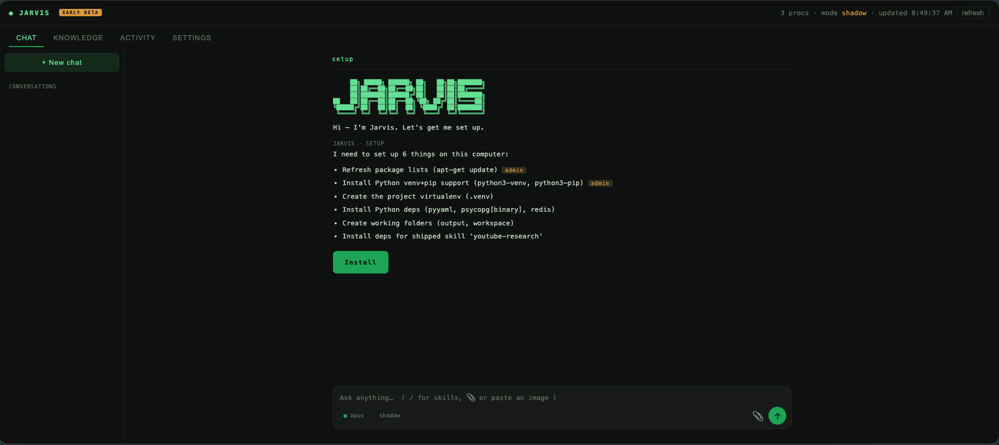

<div align="center">

```
       ██╗ █████╗ ██████╗ ██╗   ██╗██╗███████╗
       ██║██╔══██╗██╔══██╗██║   ██║██║██╔════╝
       ██║███████║██████╔╝██║   ██║██║███████╗
  ██   ██║██╔══██║██╔══██╗╚██╗ ██╔╝██║╚════██║
  ╚█████╔╝██║  ██║██║  ██║ ╚████╔╝ ██║███████║
   ╚════╝ ╚═╝  ╚═╝╚═╝  ╚═╝  ╚═══╝  ╚═╝╚══════╝
```

**A standalone, self-improving autonomous agent that lands on a machine, sets itself up,
learns its world, and works for you.**

[](LICENSE)


[Website](https://jarvisbot.app) · [Wiki](https://github.com/yohn1985/jarvisbot/wiki)

<br>



</div>

> ⚠️ **Early beta.** Jarvis can read, reason, and act on a real machine. Run it on a box you
> trust, keep it in the default **shadow / propose-only** mode until you've watched it, and read
> the Safety section before granting it more.

---

## What it is

Jarvis is a persistent agent runtime built around one idea: **a bounded loop with a real mind.**
Every wake it rebuilds its own context from durable memory, perceives its world, decides **one**
thing to do, (optionally) does it, and writes back what it learned — then it sleeps until the next
wake. It pure-Python bootstraps itself onto a fresh Linux box, autodiscovers its environment,
keeps a knowledge base, and talks to you through a web dashboard.

It is **skeptical by design**: it doesn't trust a conclusion until that conclusion has *survived an
adversarial red-team* — and it routes what it can't verify to you instead of guessing.

## Quickstart

```bash
git clone https://github.com/yohn1985/jarvisbot.git
cd jarvisbot
./install.sh up            # venv, deps, services, dashboard
```

The installer prints your **login link** (it embeds a private access token):

```
http://<this-host>:8787/?token=…
```

Open it. Lost it? Run `./install.sh url` any time (or `./install.sh token` for the raw token).
Then connect a brain in **Settings → Brain & Models** (a Claude/ChatGPT subscription login is the
cheapest; an API key works too) and say hello.

## How it works

```
wake → perceive → orient → decide (priority ladder) → act → reflect
```

- **`jarvis/kernel.py`** — one bounded tick. Dumb, reliable plumbing around a single "mind" call.
- **`jarvis/perceive.py`** — builds the world from durable signals (a source *outage* is surfaced,
  not silently treated as "nothing to do").
- **`jarvis/adapters/llm.py`** — a model router: `role → backend:model`. CLI backends (Claude,
  Codex, Ollama) and HTTP backends (OpenAI-compatible + Anthropic). Per-role effort/thinking.
- **`jarvis/memory/`** — working memory (Redis, degrades to in-process) + episodic memory
  (Postgres, degrades to a JSONL ledger). Reflections are written **and read back**, so experience
  changes behavior.
- **`jarvis/verify.py`** — the deep-fix discipline distilled: spawn a red-team agent to *disprove* a
  claim; **fail-closed** (an un-run check never counts as "passed").
- **`jarvis/safety/seatbelt.py`** — self-modification with a tamper-proof fitness gate + an
  independent red-team + a version archive to roll back to.
- **`skills/`** — shipped capabilities (web research, network discovery, deep code search,
  youtube-research). Install deps with one click; run from chat with `/skill …`.

## The dashboard

A zero-dependency (stdlib) web UI:

- **Chat** — streaming replies token-by-token, a collapsible **Thought** block, markdown + code
  blocks, image attachments (vision), steering (a new message interrupts the current one), and a
  Stop button. Type `/` to run a skill.
- **Knowledge** — what Jarvis has discovered and organized about its world.
- **Activity** — kernel ticks, spawned workers, and live processes.
- **Settings** — one page: **Brain & Models** (connect + routing), **Behavior** (identity, what it
  may do on its own, priorities), **Skills**.

## Safety defaults (read this)

- **Propose-only out of the box.** Risky action classes (`deploy`, `infra_mutate`, `self_modify`)
  are **deny** by default; you grant them deliberately in Settings.
- **The mind never scores its own work** — the fitness harness is a separate, tamper-proof process.
- **Verification fails closed** — degraded checks return "not verified," never a false pass.
- **The access token is your password** — the dashboard is gated; keep your link private. Secrets
  live only in a gitignored `.env` (chmod 600) / your vault, never in source.

## Configuration

Copy `config.example.yaml` → `config.yaml` and edit (everything is also editable from the dashboard).
Secrets go in `.env` (see `.env.example`). The `jarvis/` package is the source of truth — edit files
directly; `install.sh` never overwrites them.

## Status

Early beta and moving fast. The core loop, memory, model router, dashboard, skills, and the
self-modification seatbelt are in place. Expect rough edges; issues and PRs welcome.

## Contributing

This is open source because the vision is bigger than one person. If you see it, help build it —
open an issue or a PR. See the [Wiki](https://github.com/yohn1985/jarvisbot/wiki) for architecture
deep-dives and how to add adapters/skills.

## License

[Apache License 2.0](LICENSE) · Home: [jarvisbot.app](https://jarvisbot.app)
